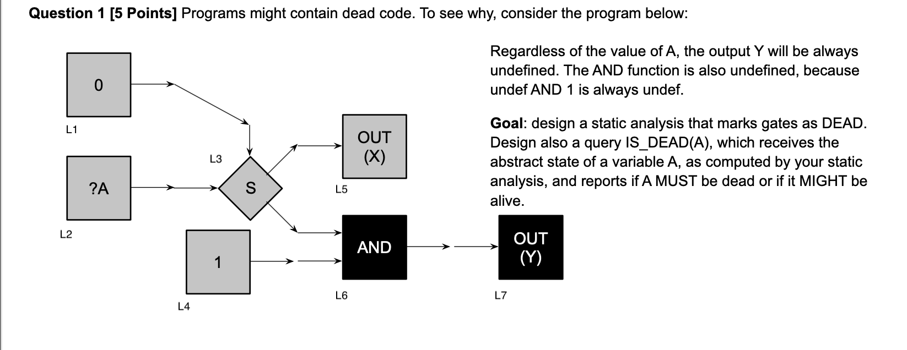

# DUD

## Question 1

### Initial working

Forward analysis. Must analysis.

The lattice is of $Scope = INPUTS \cup \{0, 1, \bot\}$ with these operations for evaluation $State = Vars \to Scope$,

- $eval(\sigma, op(Y, X)) = op(eval(\sigma, Y), eval(\sigma, X))$
- $eval(\sigma, S(Y, X)) = (snd|fst)(S(eval(\sigma, Y), eval(\sigma, X)))$
- $eval(\sigma, op(X)) = op(eval(\sigma, X))$
- $eval(\sigma, INPUT(X)) = X$
- $eval(\sigma, INPUT(N, X)) = (N > 0 \implies X) \lor (N \leq 0 \implies \bot)$
- $eval(\sigma, OUTPUT(X)) = X $

$op$:

- $AND(Y, X)$
  - $ AND(0, X) = 0 $
  - $ AND(1, X) = X $
- $OR(Y, X)$
  - $ OR(0, X) = X $
  - $ OR(1, X) = 1 $
- $ S(X, CONTROL) = \{\neg CONTROL \implies [X, \bot], CONROL \implies [\bot, X]\} $
  - $S(X, 0) = [X, \bot]$
  - $S(X, 1) = [\bot, X]$
- $NOT(X) = \neg X$

$Functions:$

- $JOIN(v) = \sqcap_{w \in pred(v)}\llbracket w \rrbracket$
- $op(Y, X): \llbracket v \rrbracket =  JOIN(v) [eval(JOIN(v), op(Y, X))]$
- $op(X): \llbracket v \rrbracket =  JOIN(v) [(eval(JOIN(v), op(X)))]$

### Workthrough

$\llbracket L7 \rrbracket = \llbracket L6 \rrbracket = \bot$
$\llbracket L6 \rrbracket = snd(AND(\llbracket L4 \rrbracket, \llbracket L3 \rrbracket)) = snd(AND(1, \llbracket L3 \rrbracket)) = snd(\llbracket L3 \rrbracket) = snd([A, \bot]) = \bot$
$\llbracket L4 \rrbracket = INPUT(1) = 1$
$\llbracket L3 \rrbracket = S(\llbracket L2 \rrbracket, \llbracket L1 \rrbracket) = S(A, \llbracket L1 \rrbracket) = S(A, 0) = [A, \bot]$
$\llbracket L2 \rrbracket = INPUT(A) = A$
$\llbracket L1 \rrbracket = 0$
$\llbracket L5 \rrbracket = fst(\llbracket L3 \rrbracket)= fst([A, \bot])= A$

### IS_DEAD(V)

$ISDEAD(V) = if (\llbracket V \rrbracket == \bot)$ $then$ $TRUE$ $else$ $FALSE$
