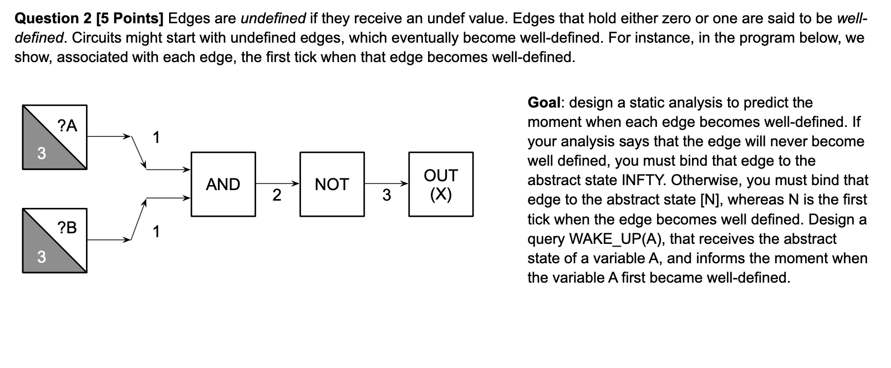

## Question 2

### Initial working q2



Forward analysis. Must analysis.

$(StartT, MaxT)$, means starts being well-defined at $StartT$ till $StartT + MaxT$ clock tick.

The lattice is of $Scope = (flat(\N) \times $INPUTS_START_N$)$ with these operations for evaluation $State = Vars \to Scope$,

- $eval(\sigma, op(Y, X)) = op(eval(\sigma, Y), eval(\sigma, X))$
- $eval(\sigma, S(Y, X)) = (snd|fst)(S(eval(\sigma, Y), eval(\sigma, X)))$
- $eval(\sigma, op(X)) = op(eval(\sigma, X))$
- $eval(\sigma, INPUT(X)) = (0, \infty)$
- $eval(\sigma, INPUT(N, X)) = (N > 0 \implies (0, N)) \lor (N \leq 0 \implies (\infty, 0))$
- $eval(\sigma, OUTPUT(XS, XM)) = (XS + 1, XM) $

$op$:

```haskell
CALC_RANGE((YS, YM), (XS, XM)) =  let range = ([YS .. (YS + YM)] `intersect` [XS .. (XS + XM)])
                                  in  if (length(range) `equal` 0 then return (INFINITY, 0))
                                      else return (min(range) + 1, length(range))
```

- $ AND((YS, YM), (XS, XM)) = CALC_{RANGE}((YS, YM), (XS, XM))$

- $ OR((YS, YM), (XS, XM)) = CALC_{RANGE}((YS, YM), (XS, XM))$
- $ S(X, C) = \{$
  - $\neg C \implies [CALC_{RANGE}(X,C), [\infty,0]]$,
  - $C \implies [[\infty,0], CALC_{RANGE}(X,C)]\}$
- $NOT((XS, XM)) = (XS + 1, XM)$

$Functions:$

- $JOIN(v) = \sqcap_{w \in pred(v)}\llbracket w \rrbracket$
- $op(Y, X): \llbracket v \rrbracket =  JOIN(v) [eval(JOIN(v), op(Y, X))]$
- $op(X): \llbracket v \rrbracket =  JOIN(v) [(eval(JOIN(v), op(X)))]$

### Workthrough q2

$\llbracket L1 \rrbracket = INPUT(3, A) = (0, 3)$
$\llbracket L2 \rrbracket = INPUT(3, B) = (0, 3)$
$\llbracket L3 \rrbracket = AND(\llbracket L1 \rrbracket, \llbracket L1 \rrbracket)  = AND((0, 3), (0, 3)) = (1, 3)$
$\llbracket L4 \rrbracket = NOT(\llbracket L3 \rrbracket) = NOT((1, 3)) = (2, 3)$
$\llbracket L5 \rrbracket = OUT(\llbracket L4 \rrbracket) = OUT((2, 3)) = (3, 3)$

### WAKE_UP(V) q2

$WAKE$_$UP(V) = if (fst(\llbracket V \rrbracket) == \infty)$ $then$ $TRUE$ $else$ $FALSE$

### Time \& Space q2

WAKE_UP is just time: O(1) \& space: O(1) if constructed abstrace states.

#### Time q2

O(E) for E nodes, must visit each once.

#### Space q2

Just contains the abstract value of the Node, so O(1) for each Node hence O(E) for E nodes.
