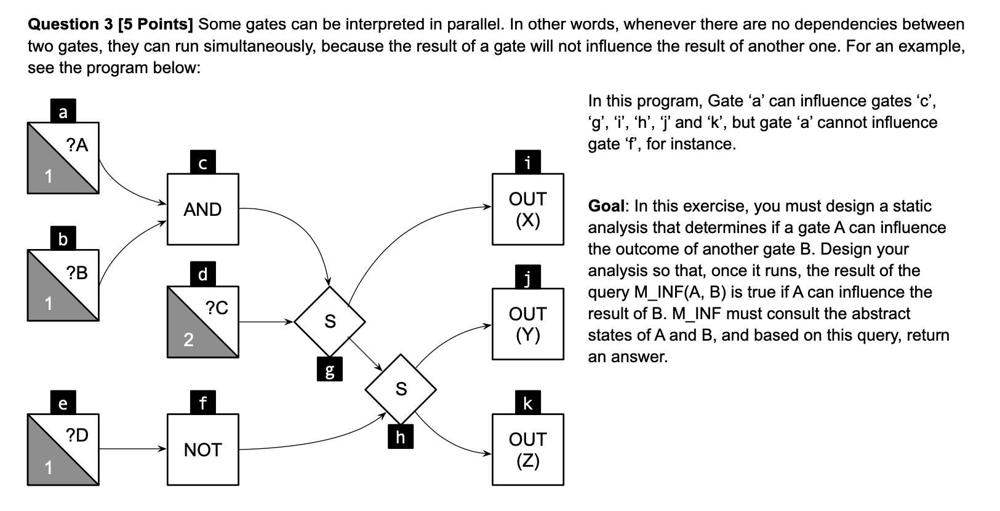

# DUD

## Question 3

### Initial working

Forward analysis. Must analysis.

The lattice is of $Scope = \wp(Vars)$ with these operations for evaluation $State = \{Vars, \subseteq\}$,

- $eval(\sigma, op(Y, X)) = op(eval(\sigma, Y), eval(\sigma, X))$
- $eval(\sigma, S(Y, X)) = (snd|fst)(S(eval(\sigma, Y), eval(\sigma, X)))$
- $eval(\sigma, op(X)) = op(eval(\sigma, X))$
- $eval(\sigma, INPUT(X)) = X$
- $eval(\sigma, INPUT(N, X)) = (N > 0 \implies X) \lor (N \leq 0 \implies \bot)$
- $eval(\sigma, OUTPUT(X)) = X $

$op$:

- $AND(Y, X)$
  - $ AND(0, X) = \varnothing $
  - $ AND(1, X) = X $
- $OR(Y, X)$
  - $ OR(0, X) = X $
  - $ OR(1, X) = \varnothing $
- $ S(X, CONTROL) = \{\neg CONTROL \implies [X, \bot], CONROL \implies [\bot, X]\} $
  - $S(X, 0) = [X, \varnothing]$
  - $S(X, 1) = [\varnothing, X]$
  - $S(X, Y) = [\{X,Y\}, \{X,Y\}]$
- $NOT(X) = X$

$Functions:$

- $JOIN(v) = \bigsqcup_{w \in pred(v)}\llbracket w \rrbracket$
- $op(Y, X): \llbracket v \rrbracket =  JOIN(v) [eval(JOIN(v), op(Y, X))]$
- $op(X): \llbracket v \rrbracket =  JOIN(v) [(eval(JOIN(v), op(X)))]$

### Workthrough

$\llbracket i \rrbracket = \{ i \} \cup \llbracket g \rrbracket = \{i,g,c,b,a,d\}$
$\llbracket j \rrbracket = \{ j \} \cup \llbracket h \rrbracket = \{j,h, g,c,b,a,d,f,e\}$
$\llbracket k \rrbracket = \{ k \} \cup \llbracket h \rrbracket = \{k,h, g,c,b,a,d,f,e\}$
$\llbracket h \rrbracket = \{ h \} \cup \llbracket g \rrbracket \cup \llbracket f \rrbracket = \{h, g,c,b,a,d,f,e\}$
$\llbracket f \rrbracket = \{ f \} \cup \llbracket e \rrbracket = \{f,e\}$
$\llbracket e \rrbracket = \{ e \}$
$\llbracket g \rrbracket = \{ g \} \cup \llbracket c \rrbracket \cup \llbracket d \rrbracket = \{g,c,b,a,d\}$
$\llbracket d \rrbracket = \{ d \}$
$\llbracket c \rrbracket = \{ c \} \cup \llbracket b \rrbracket \cup \llbracket a \rrbracket = \{c,b,a\}$
$\llbracket b \rrbracket = \{ b \}$
$\llbracket a \rrbracket = \{ a \}$

### M_INF(V,W)

$MINF(V,W) = if (\{V\} \subset \llbracket W \rrbracket)$ $then$ $TRUE$ $else$ $FALSE$
