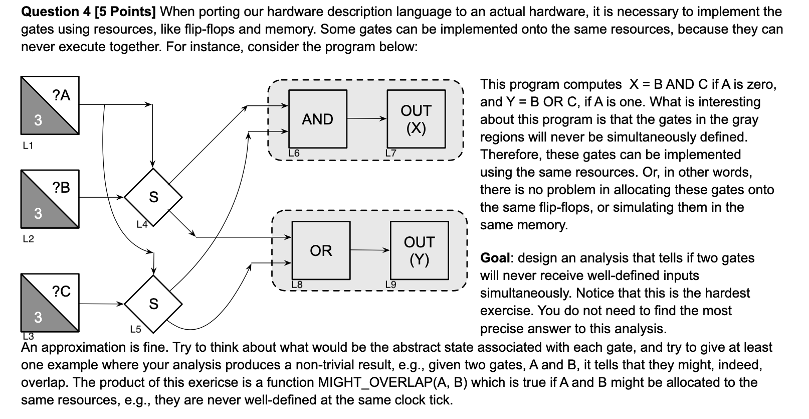

## Question 4

### Initial thoughts q4

- E4.1: selector at L4 bound with $\neg \llbracket L1 \rrbracket$
- E4.2: selector at L4 bound with $\llbracket L1 \rrbracket$
- E5.1: selector at L4 bound with $\neg \llbracket L1 \rrbracket$
- E5.2: selector at L4 bound with $\llbracket L1 \rrbracket$

Product lattice of selectors and variables, Set Union.

Reject inconsistent state e.g $s_{l4}@\llbracket L1 \rrbracket \land s_{l4}@\neg \llbracket L1 \rrbracket$.

Simplify the gates using the previous question 1 technique.

Bundle nodes with same abstract states together.

For each bundle switch on the variables needed to power this current bundle, identify other bundles that light up. These will be the bundles that overlap with this one lets call them activeCurr. Remove them from the set of all bundles to get the bundles that do not overlap.

### Initial working q4

Forward analysis. Must analysis.

The lattice is of $States = \{SELECTORS \times VARIABLES, \subseteq\}$.

- $eval(\sigma, op(Y, X)) = op(eval(\sigma, Y), eval(\sigma, X))$
- $eval(\sigma, S(Y, X)) = (snd|fst)(S(eval(\sigma, Y), eval(\sigma, X)))$
- $eval(\sigma, op(X)) = op(eval(\sigma, X))$
- $eval(\sigma, INPUT(X)) = X$
- $eval(\sigma, INPUT(N, X)) = (N > 0 \implies X) \lor (N \leq 0 \implies \varnothing)$
- $eval(\sigma, OUTPUT(X)) = \varnothing $

$op$:

- $AND(Y, X)$
  - $ AND(0, X) = \varnothing $
  - $ AND(1, X) = X $
  - $ AND(Y, X) = X \cup Y $
- $OR(Y, X)$
  - $ OR(0, X) = X $
  - $ OR(1, X) = \varnothing $
  - $ OR(Y, X) = X \cup Y $
- $ S_{label}(X, CONTROL) = \{\neg CONTROL \implies (S_{label}, \neg CONTROL), CONROL \implies (S_{label}, CONTROL)\} $
  - $S_{label}(X, 0) = [(S_{label}, \neg CONTROL), \bot]$
  - $S_{label}(X, 1) = [\bot, (S_{label}, CONTROL)]$
- $NOT(X) = \neg X$ (apply inside on to vars, i.e. snd)

$Functions:$

- $JOIN(v) = \sqcap_{w \in pred(v)}\llbracket w \rrbracket$
- $op(Y, X): \llbracket v \rrbracket =  JOIN(v) [eval(JOIN(v), op(Y, X))]$
- $op(X): \llbracket v \rrbracket =  JOIN(v) [(eval(JOIN(v), op(X)))]$

### Workthrough q4

Not given.

### MIGHT_OVERLAP(V, W) q4

$MIGHT$_$OVERLAP(V, W) = if (\llbracket V \rrbracket \cap \llbracket W \rrbracket) == \varnothing$ $then$ $FALSE$ $else$ $TRUE$
