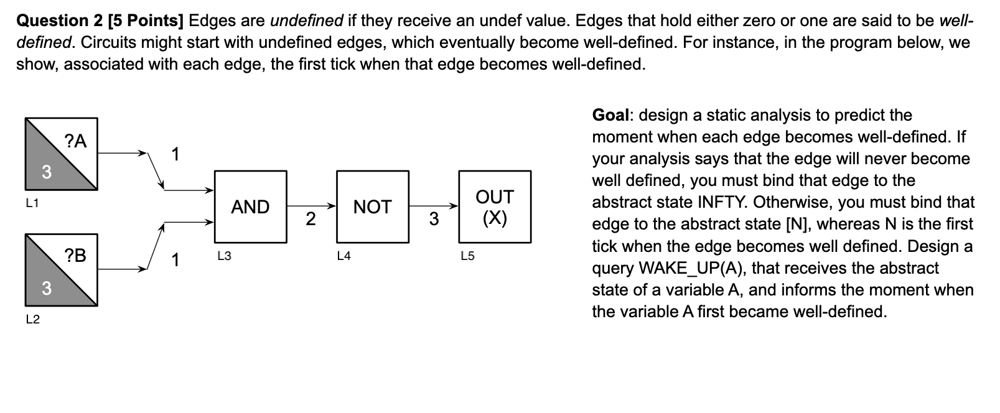

# ather, Midsem 2022 dcc888

## Question 1

### Initial working q1


Forward analysis. Must analysis.

The lattice is of $Scope = INPUTS \cup \{0, 1, \bot\}$ with these operations for evaluation $State = Vars \to Scope$,

- $eval(\sigma, op(Y, X)) = op(eval(\sigma, Y), eval(\sigma, X))$
- $eval(\sigma, S(Y, X)) = (snd|fst)(S(eval(\sigma, Y), eval(\sigma, X)))$
- $eval(\sigma, op(X)) = op(eval(\sigma, X))$
- $eval(\sigma, INPUT(X)) = X$
- $eval(\sigma, INPUT(N, X)) = (N > 0 \implies X) \lor (N \leq 0 \implies \bot)$
- $eval(\sigma, OUTPUT(X)) = X $

$op$:

- $AND(Y, X)$
  - $ AND(0, X) = 0 $
  - $ AND(1, X) = X $
- $OR(Y, X)$
  - $ OR(0, X) = X $
  - $ OR(1, X) = 1 $
- $ S(X, CONTROL) = \{\neg CONTROL \implies [X, \bot], CONROL \implies [\bot, X]\} $
  - $S(X, 0) = [X, \bot]$
  - $S(X, 1) = [\bot, X]$
- $NOT(X) = \neg X$

$Functions:$

- $JOIN(v) = \sqcap_{w \in pred(v)}\llbracket w \rrbracket$
- $op(Y, X): \llbracket v \rrbracket =  JOIN(v) [eval(JOIN(v), op(Y, X))]$
- $op(X): \llbracket v \rrbracket =  JOIN(v) [(eval(JOIN(v), op(X)))]$

### Workthrough q1

$\llbracket L7 \rrbracket = \llbracket L6 \rrbracket = \bot$
$\llbracket L6 \rrbracket = snd(AND(\llbracket L4 \rrbracket, \llbracket L3 \rrbracket)) = snd(AND(1, \llbracket L3 \rrbracket)) = snd(\llbracket L3 \rrbracket) = snd([A, \bot]) = \bot$
$\llbracket L4 \rrbracket = INPUT(1) = 1$
$\llbracket L3 \rrbracket = S(\llbracket L2 \rrbracket, \llbracket L1 \rrbracket) = S(A, \llbracket L1 \rrbracket) = S(A, 0) = [A, \bot]$
$\llbracket L2 \rrbracket = INPUT(A) = A$
$\llbracket L1 \rrbracket = 0$
$\llbracket L5 \rrbracket = fst(\llbracket L3 \rrbracket)= fst([A, \bot])= A$

### IS_DEAD(V) q1

$IS$_$DEAD(V) = if (\llbracket V \rrbracket == \bot)$ $then$ $TRUE$ $else$ $FALSE$

### Time \& Space q1

IS_DEAD is just time: O(1) \& space: O(1) if constructed abstrace states.

#### Time q1

O(E) for E nodes, must visit each once.

#### Space q1

Just contains the abstract value of the Node, so O(1) for each Node hence O(E) for E nodes.

## Question 2

### Initial working q2



Forward analysis. Must analysis.

$(StartT, MaxT)$, means starts being well-defined at $StartT$ till $StartT + MaxT$ clock tick.

The lattice is of $Scope = (flat(\N) \times $INPUTS_START_N$)$ with these operations for evaluation $State = Vars \to Scope$,

- $eval(\sigma, op(Y, X)) = op(eval(\sigma, Y), eval(\sigma, X))$
- $eval(\sigma, S(Y, X)) = (snd|fst)(S(eval(\sigma, Y), eval(\sigma, X)))$
- $eval(\sigma, op(X)) = op(eval(\sigma, X))$
- $eval(\sigma, INPUT(X)) = (0, \infty)$
- $eval(\sigma, INPUT(N, X)) = (N > 0 \implies (0, N)) \lor (N \leq 0 \implies (\infty, 0))$
- $eval(\sigma, OUTPUT(XS, XM)) = (XS + 1, XM) $

$op$:

```haskell
CALC_RANGE((YS, YM), (XS, XM)) =  let range = ([YS .. (YS + YM)] `intersect` [XS .. (XS + XM)])
                                  in  if (length(range) `equal` 0 then return (INFINITY, 0))
                                      else return (min(range) + 1, length(range))
```

- $ AND((YS, YM), (XS, XM)) = CALC_{RANGE}((YS, YM), (XS, XM))$

- $ OR((YS, YM), (XS, XM)) = CALC_{RANGE}((YS, YM), (XS, XM))$
- $ S(X, C) = \{$
  - $\neg C \implies [CALC_{RANGE}(X,C), [\infty,0]]$,
  - $C \implies [[\infty,0], CALC_{RANGE}(X,C)]\}$
- $NOT((XS, XM)) = (XS + 1, XM)$

$Functions:$

- $JOIN(v) = \sqcap_{w \in pred(v)}\llbracket w \rrbracket$
- $op(Y, X): \llbracket v \rrbracket =  JOIN(v) [eval(JOIN(v), op(Y, X))]$
- $op(X): \llbracket v \rrbracket =  JOIN(v) [(eval(JOIN(v), op(X)))]$

### Workthrough q2

$\llbracket L1 \rrbracket = INPUT(3, A) = (0, 3)$
$\llbracket L2 \rrbracket = INPUT(3, B) = (0, 3)$
$\llbracket L3 \rrbracket = AND(\llbracket L1 \rrbracket, \llbracket L1 \rrbracket)  = AND((0, 3), (0, 3)) = (1, 3)$
$\llbracket L4 \rrbracket = NOT(\llbracket L3 \rrbracket) = NOT((1, 3)) = (2, 3)$
$\llbracket L5 \rrbracket = OUT(\llbracket L4 \rrbracket) = OUT((2, 3)) = (3, 3)$

### WAKE_UP(V) q2

$WAKE$_$UP(V) = if (fst(\llbracket V \rrbracket) == \infty)$ $then$ $TRUE$ $else$ $FALSE$

### Time \& Space q2

WAKE_UP is just time: O(1) \& space: O(1) if constructed abstrace states.

#### Time q2

O(E) for E nodes, must visit each once.

#### Space q2

Just contains the abstract value of the Node, so O(1) for each Node hence O(E) for E nodes.

## Question 3

### Initial working q3


Forward analysis. Must analysis.

The lattice is of $Scope = \wp(Vars)$ with these operations for evaluation $State = \{Vars, \subseteq\}$,

- $eval(\sigma, op(Y, X)) = op(eval(\sigma, Y), eval(\sigma, X))$
- $eval(\sigma, S(Y, X)) = (snd|fst)(S(eval(\sigma, Y), eval(\sigma, X)))$
- $eval(\sigma, op(X)) = op(eval(\sigma, X))$
- $eval(\sigma, INPUT(X)) = X$
- $eval(\sigma, INPUT(N, X)) = (N > 0 \implies X) \lor (N \leq 0 \implies \bot)$
- $eval(\sigma, OUTPUT(X)) = X $

$op$:

- $AND(Y, X)$
  - $ AND(0, X) = \varnothing $
  - $ AND(1, X) = X $
- $OR(Y, X)$
  - $ OR(0, X) = X $
  - $ OR(1, X) = \varnothing $
- $ S(X, CONTROL) = \{\neg CONTROL \implies [X, \bot], CONROL \implies [\bot, X]\} $
  - $S(X, 0) = [X, \varnothing]$
  - $S(X, 1) = [\varnothing, X]$
  - $S(X, Y) = [\{X,Y\}, \{X,Y\}]$
- $NOT(X) = X$

$Functions:$

- $JOIN(v) = \bigsqcup_{w \in pred(v)}\llbracket w \rrbracket$
- $op(Y, X): \llbracket v \rrbracket =  JOIN(v) [eval(JOIN(v), op(Y, X))]$
- $op(X): \llbracket v \rrbracket =  JOIN(v) [(eval(JOIN(v), op(X)))]$

### Workthrough q3

$\llbracket i \rrbracket = \{ i \} \cup \llbracket g \rrbracket = \{i,g,c,b,a,d\}$
$\llbracket j \rrbracket = \{ j \} \cup \llbracket h \rrbracket = \{j,h, g,c,b,a,d,f,e\}$
$\llbracket k \rrbracket = \{ k \} \cup \llbracket h \rrbracket = \{k,h, g,c,b,a,d,f,e\}$
$\llbracket h \rrbracket = \{ h \} \cup \llbracket g \rrbracket \cup \llbracket f \rrbracket = \{h, g,c,b,a,d,f,e\}$
$\llbracket f \rrbracket = \{ f \} \cup \llbracket e \rrbracket = \{f,e\}$
$\llbracket e \rrbracket = \{ e \}$
$\llbracket g \rrbracket = \{ g \} \cup \llbracket c \rrbracket \cup \llbracket d \rrbracket = \{g,c,b,a,d\}$
$\llbracket d \rrbracket = \{ d \}$
$\llbracket c \rrbracket = \{ c \} \cup \llbracket b \rrbracket \cup \llbracket a \rrbracket = \{c,b,a\}$
$\llbracket b \rrbracket = \{ b \}$
$\llbracket a \rrbracket = \{ a \}$

### M_INF(V,W) q3

$M$_$INF(V,W) = if (\{V\} \subset \llbracket W \rrbracket)$ $then$ $TRUE$ $else$ $FALSE$

### Time \& Space q3

M_INF is just time: $O(|\llbracket W \rrbracket|)$ \& space: O(1) if constructed abstrace states.

#### Time q3

O(E) for E nodes, must visit each once.

#### Space q3

Just contains the abstract value of the Node, so O(1) for each Node hence O(E) for E nodes.

## Question 4

### Initial thoughts q4


- E4.1: selector at L4 bound with $\neg \llbracket L1 \rrbracket$
- E4.2: selector at L4 bound with $\llbracket L1 \rrbracket$
- E5.1: selector at L4 bound with $\neg \llbracket L1 \rrbracket$
- E5.2: selector at L4 bound with $\llbracket L1 \rrbracket$

Product lattice of selectors and variables, Set Union.

Reject inconsistent state e.g $s_{l4}@\llbracket L1 \rrbracket \land s_{l4}@\neg \llbracket L1 \rrbracket$.

Simplify the gates using the previous question 1 technique.

Bundle nodes with same abstract states together.

For each bundle switch on the variables needed to power this current bundle, identify other bundles that light up. These will be the bundles that overlap with this one lets call them activeCurr. Remove them from the set of all bundles to get the bundles that do not overlap.

### Initial working q4

Forward analysis. Must analysis.

The lattice is of $States = \{SELECTORS \times VARIABLES, \subseteq\}$.

- $eval(\sigma, op(Y, X)) = op(eval(\sigma, Y), eval(\sigma, X))$
- $eval(\sigma, S(Y, X)) = (snd|fst)(S(eval(\sigma, Y), eval(\sigma, X)))$
- $eval(\sigma, op(X)) = op(eval(\sigma, X))$
- $eval(\sigma, INPUT(X)) = X$
- $eval(\sigma, INPUT(N, X)) = (N > 0 \implies X) \lor (N \leq 0 \implies \varnothing)$
- $eval(\sigma, OUTPUT(X)) = \varnothing $

$op$:

- $AND(Y, X)$
  - $ AND(0, X) = \varnothing $
  - $ AND(1, X) = X $
  - $ AND(Y, X) = X \cup Y $
- $OR(Y, X)$
  - $ OR(0, X) = X $
  - $ OR(1, X) = \varnothing $
  - $ OR(Y, X) = X \cup Y $
- $ S_{label}(X, CONTROL) = \{\neg CONTROL \implies (S_{label}, \neg CONTROL), CONROL \implies (S_{label}, CONTROL)\} $
  - $S_{label}(X, 0) = [(S_{label}, \neg CONTROL), \bot]$
  - $S_{label}(X, 1) = [\bot, (S_{label}, CONTROL)]$
- $NOT(X) = \neg X$ (apply inside on to vars, i.e. snd)

$Functions:$

- $JOIN(v) = \sqcap_{w \in pred(v)}\llbracket w \rrbracket$
- $op(Y, X): \llbracket v \rrbracket =  JOIN(v) [eval(JOIN(v), op(Y, X))]$
- $op(X): \llbracket v \rrbracket =  JOIN(v) [(eval(JOIN(v), op(X)))]$

### Workthrough q4

Not given.

### MIGHT_OVERLAP(V, W) q4

$MIGHT$_$OVERLAP(V, W) = if (\llbracket V \rrbracket \cap \llbracket W \rrbracket) == \varnothing$ $then$ $FALSE$ $else$ $TRUE$
